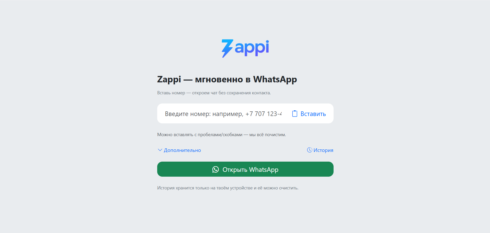

# Zappi ✨

*A bridge from phone number to chat.*  
Paste a number → hit the button → the dialog opens. No **“save contact”** hassle. ⚡

---

## What it is 🧩
Frontend-only web app. No server, no database. Everything runs in the browser.

---

## How it works ▶️
1. Paste or type a number (parentheses, spaces, dashes allowed).  
2. We clean & normalize it (incl. **8→7** for RU/KZ).  
3. Tap **Open WhatsApp** — universal link opens the chat on mobile or desktop.

---

## Interface 🖥️
- **Number field** + **Paste** (input group)  
- **Open WhatsApp** (primary CTA)  
- **Additional** (collapse) → multiline message  
- **History** (collapse) → recent numbers: insert / delete / clear  
- Inline error messages under the field

---

## UI copy ✍️
- **Title:** *Zappi — instant to WhatsApp*  
- **Subtitle:** *Paste a number — we’ll open the chat without saving a contact.*  
- **Placeholder:** *Enter a number: e.g., +7 707 123-45-67*  
- **Buttons:** *Paste*, *Open WhatsApp*, *Additional*, *History*, *Clear all*  
- **Error:** *This doesn’t look like an international number. Check length and country code.*

---

## What it does now ✅
- Parses from clipboard & strips extra characters  
- Normalizes local formats (incl. RU/KZ)  
- Validates length against international standard  
- Adds an optional pre-filled message to the chat  
- Stores recent numbers **locally** (on the user’s device)

---

## Screenshot 🖼️

---

## Limitations ⚠️
- No cloud sync: history/settings don’t travel across devices  
- Deep links vary by platform — universal links favored for stability  
- Very long messages can hit URL length limits in some browsers

---

## Next (frontend-only roadmap) 🚀
- [ ] **PWA**: install to home screen, offline static assets  
- [ ] **QR**: generate PNG/SVG, “Download”  
- [ ] **Channels**: Telegram / Viber / SMS / Email (switcher)  
- [ ] **Batch**: paste a list → open dialogs sequentially  
- [ ] **Pages**: mini “link-in-bio” via URL parameters  
- [ ] **Widget**: “Message us” embed for any website  
- [ ] **i18n**: RU/EN toggle & local storage

---

## Branding 🎨
- **Wordmark:** “Zappi” in black  
- **Mark:** lightning bolt (accent/gradient per brand guide)  
- **Assets:** transparent backgrounds for logos/icons  
- **Favicon:** single source at `/favicon.ico` (avoid conflicts)

---

## License 📄
**MIT** — see `LICENSE`.
